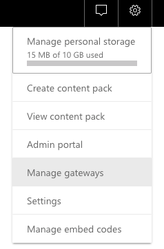
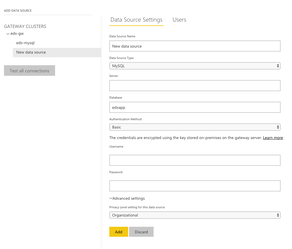
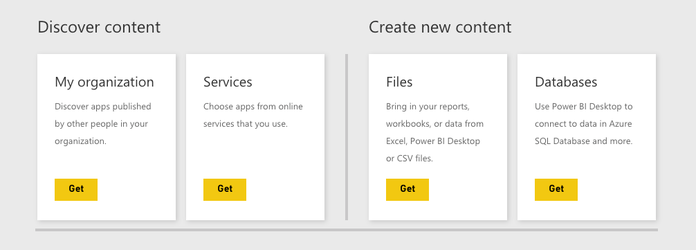
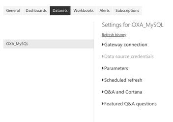
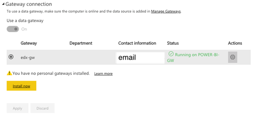
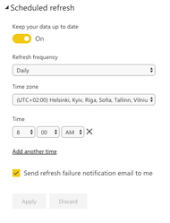

PowerBI workspace templates for Microsoft LaaS OpenEdx installations
=====

- [LaaSOpenEdx.pbix](LaaSOpenEdx.pbix) - This is a template for reporting student activity on OpenEdx.
- [LaaSTop100Statistics.pbix](LaaSTop100Statistics.pbix) - Advanced version of LaaSOpenEdx.pbix template
  with TOP10-20 monthly, yearly reports for enrollments and completions

HOWTO
=====

Configure app.powerbi.com workspace with permissive gateway:

### 1. Authorization in Power BI Gateway on Windows Server

- Connect to Windows server via RDP with additionally provided credentials.
- Run Power BI Gateway.
- Click "Sign in", enter your Office365 email and password.
- Go to "Network" in the right menu bar, click the "Check now" button to check connection.
- Do not close the Gateway window; terminate RDP session.

### 2. Configure Gateway connection and Data Source Settings
- Sign in https://app.powerbi.com
- Choose the desirable workspace.
- Go to "Settings" menu, click "Manage gateways".

- Power BI Web Application detect your Gateway.
- Add "Data Source" with additionally provided MySQL credentials and settings; configure Advanced settings and Users (if necessary)

- Click the "Test all connections" button; the test must finish successfully.

### 3. Add and configure a report template
- Download the [report template](LaaSOpenEdx.pbix)
- Go to "Get data" at the bottom of your management panel.
- Import downloaded .pbix file from the local storage.

- Go to "Settings" and click "Datasets".

- Gateway connection details must coincide with the details provided on the screenshot below.

- Configure the "Scheduled refresh" and apply the changes.

- In the "Datasets" tab of the Workspace, click "Refresh now" (in the "Actions" column).

- In "Reports", click your report (your data must be in the report).
