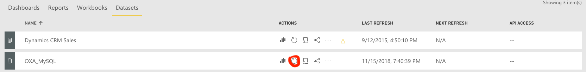

PowerBI workspace template for Microsoft LaaS OpenEdx installations
=====

This is a template for reporting student activity on OpenEdx.

HOWTO
=====

Configure app.powerbi.com workspace with permissive gateway:

### 1. Authorization in Power BI Gateway on Windows Server

- Connect to Windows server via RDP with additionally provided credentials
- Run Power BI Gateway
- Click "Sign in", enter your Office365 email and password
- Go to "Network" in right menu bar, check connection by "Check now" button
- Don't close Gateway window and terminate RDP session

### 2. Configure Gateway connection and Data Source Settings
- Sign in into https://app.powerbi.com
- Choose workspace you need
- Go to "Settings" menu, choose "Manage gateways"

- Power BI Web Application will detect your Gateway
- Add "Data Source" with additionally provided MySQL credentials and settings, configure Advanced settings and Users, if you need

- Press "Test all connections" button.

### 3. Add and configure a report template
- Download the report template from [GitHub](LaaSOpenEdx.pbix)
- Go to "Get data" in bottom of your management panel 
- Import downloaded .pbix file from local storage

- Go to "Settings" and choose "Datasets" 

- Gateway connection must look like this in when all is okay

- Configure you Scheduled refresher and apply the changes

- Go to your Workspace, Datasets column, click on "Refresh now" in Action column

- Choose your report in Reports, it must be with your data now.  
